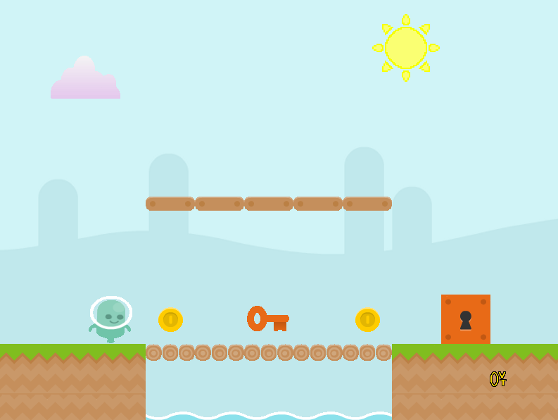

# XPlatformer

## Summary

XPlatformer is a simple video game reminiscent of the classic side-scrolling arcade game, using the XLib API. The point of the game is to control a character through a terrain to meet an objective. The project makes use of the XLib API (XOrg) and focus on code that was developed to accomplish tasks for the assignment task.

